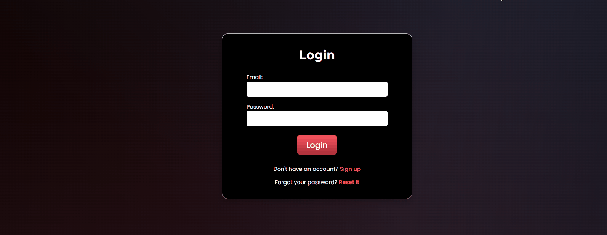
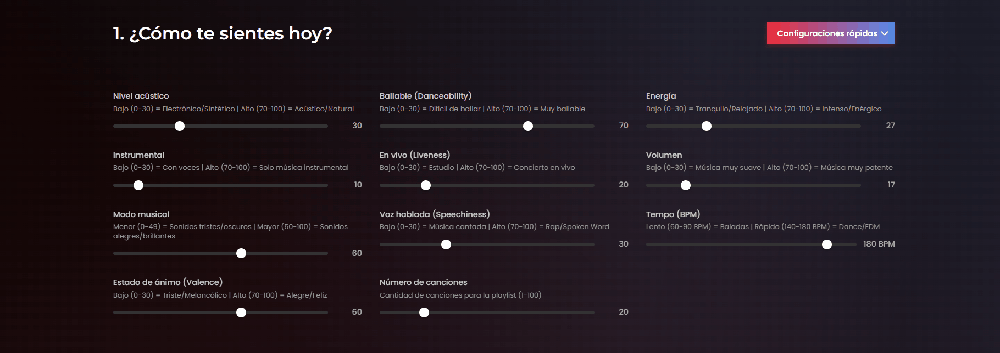
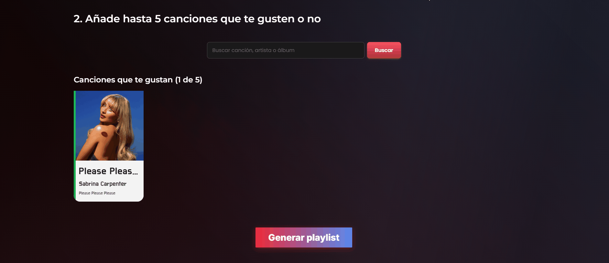
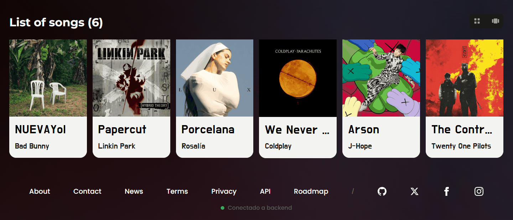

<br>
<p align="center">
  
</p>

<p align="center">
  <strong>Genera playlists de Spotify personalizadas basadas en tu estado de ánimo</strong>
</p>

<p align="center">
  PlayTheMood es una aplicación web fullstack que transforma tus emociones en música, creando listas de reproducción perfectamente adaptadas a cómo te sientes en cada momento mediante inteligencia artificial y la API de Spotify.
</p>

---

## Tabla de Contenidos

1. [Descripción General](#descripción-general)
2. [Características Principales](#características-principales)
3. [Stack Tecnológico](#stack-tecnológico)
   - [Frontend](#frontend)
   - [Backend](#backend)
   - [Base de Datos](#base-de-datos)
   - [Herramientas y DevOps](#herramientas-y-devops)
4. [Estructura del Proyecto](#estructura-del-proyecto)
5. [Requisitos Previos](#requisitos-previos)
6. [Instalación](#instalación)
   - [Instalación con Docker](#opción-1-instalación-con-docker-recomendado)
   - [Instalación Manual](#opción-2-instalación-manual)
7. [Configuración de Variables de Entorno](#configuración-de-variables-de-entorno)
8. [Comandos Disponibles](#comandos-disponibles)
9. [Capturas de Pantalla](#capturas-de-pantalla)
10. [Despliegue](#despliegue)
11. [Roadmap y Mejoras Futuras](#roadmap-y-mejoras-futuras)
12. [Contribuciones](#contribuciones)
13. [Equipo de Desarrollo](#equipo-de-desarrollo)
14. [Documentación Adicional](#documentación-adicional)
15. [Licencia](#licencia)
16. [Contacto y Soporte](#contacto-y-soporte)

---

## Descripción General


PlayTheMood es una aplicación web moderna que revoluciona la forma en que descubres y disfrutas música. Mediante un sistema inteligente de análisis emocional y parámetros musicales personalizables, la aplicación genera playlists de Spotify completamente adaptadas a tu estado de ánimo actual.

**¿Para qué sirve PlayTheMood?**
- Descubrir nueva música que coincida perfectamente con tu estado emocional
- Crear playlists personalizadas sin búsqueda manual
- Explorar diferentes géneros y artistas basados en parámetros de audio avanzados
- Guardar y gestionar tus playlists favoritas

**Contexto Académico**

Este proyecto ha sido desarrollado como parte del módulo de **Proyecto Intermodular** del ciclo formativo de Desarrollo de Aplicaciones Web, combinando conocimientos de:
- Desarrollo de aplicaciones web fullstack
- Integración con APIs externas
- Gestión de bases de datos NoSQL
- Arquitectura de software moderna
- DevOps y despliegue en producción

**Aplicación en Producción:** [playthemood.dev](http://playthemood.dev)

---

## Características Principales

- **Autenticación Segura**: Sistema de registro y login con JWT tokens y encriptación bcrypt
- **Generación Inteligente de Playlists**: Algoritmo basado en parámetros de audio de Spotify (energía, valencia, tempo, etc.)
- **12 Presets Musicales Predefinidos**: K-pop, Chill, Party, Workout, Focus, Sleep, Jazz, Rock, Electronic, Latin, Indie, Classical
- **Búsqueda Avanzada de Canciones**: Integración completa con la base de datos de Spotify
- **Gestión de Playlists**: Crear, editar, eliminar y organizar tus listas de reproducción
- **Parámetros Personalizables**: Control fino sobre energía, positividad, bailabilidad, acústica, instrumentalidad y popularidad
- **Interfaz Responsive**: Diseño adaptable para desktop, tablet y móvil
- **Almacenamiento Persistente**: Base de datos MongoDB para guardar usuarios, playlists y configuraciones
- **API RESTful Documentada**: Backend robusto con endpoints bien definidos y documentados
- **Testing Automatizado**: Suite completa de tests con Postman/Newman
- **Containerización con Docker**: Despliegue simplificado mediante contenedores

---

## Stack Tecnológico

### Frontend

| Tecnología | Versión | Propósito |
|------------|---------|-----------|
| **React** | 19.1 | Framework UI con hooks modernos |
| **Vite** | 7.1 (Rolldown) | Build tool ultra-rápido con HMR |
| **React Router** | 7.9 | Enrutamiento SPA y rutas protegidas |
| **Axios** | 1.13 | Cliente HTTP con interceptores |
| **CSS Modules** | - | Estilos aislados por componente |
| **ESLint** | 9.36 | Linter de código |
| **MSW** | 2.12 | Mock Service Worker para testing |

**Características Frontend:**
- Context API para gestión de estado global
- Lazy loading de componentes
- Validación de formularios client-side
- Arquitectura de componentes atómicos (Atoms, Molecules, Organisms)

### Backend

| Tecnología | Versión | Propósito |
|------------|---------|-----------|
| **Node.js** | 18+ | Runtime de JavaScript |
| **Express** | 4.21 | Framework web minimalista |
| **Mongoose** | 8.20 | ODM para MongoDB |
| **JWT** | 9.0 | Autenticación con tokens |
| **Bcrypt** | 6.0 | Hash seguro de contraseñas |
| **Winston** | 3.19 | Sistema de logging profesional |
| **Helmet** | 8.1 | Seguridad con headers HTTP |
| **Express Rate Limit** | 8.2 | Protección contra ataques de fuerza bruta |
| **Axios** | 1.13 | Cliente para Spotify API |

**Características Backend:**
- Arquitectura en capas (Controllers, Services, DTOs, Models)
- Middleware de autenticación y autorización
- Rate limiting (100 req/15min general, 5 req/15min auth)
- Sanitización contra inyección NoSQL
- CORS configurado para producción
- Documentación JSDoc completa

### Base de Datos

| Tecnología | Versión | Propósito |
|------------|---------|-----------|
| **MongoDB** | 7+ | Base de datos NoSQL |
| **MongoDB Atlas** | - | Hosting en la nube (producción) |

**Esquemas:**
- Users (autenticación y perfil)
- Songs (catálogo de Spotify cacheado)
- Playlists (configuración y tracks)

### Herramientas y DevOps

| Tecnología | Versión | Propósito |
|------------|---------|-----------|
| **Docker** | - | Containerización de servicios |
| **Docker Compose** | - | Orquestación multi-contenedor |
| **Nginx** | - | Proxy inverso y servidor estático |
| **Newman** | 6.2 | Testing automatizado de API |
| **Postman** | - | Desarrollo y documentación de API |
| **Git** | - | Control de versiones |
| **GitHub** | - | Repositorio y CI/CD |

---

## Estructura del Proyecto

```
PlayTheMood/
├── backend/                          # API REST (Node.js + Express)
│   ├── src/
│   │   ├── config/                  # Configuración (DB, app)
│   │   │   ├── appConfig.js        # Variables centralizadas
│   │   │   ├── database.js         # Conexión MongoDB
│   │   │   └── seed.js             # Datos iniciales
│   │   ├── constants/              # Constantes de la aplicación
│   │   │   ├── httpStatusCodes.js # Códigos HTTP estandarizados
│   │   │   └── errorMessages.js   # Mensajes centralizados
│   │   ├── controllers/            # Controladores de rutas
│   │   │   ├── userController.js
│   │   │   ├── songController.js
│   │   │   └── playlistController.js
│   │   ├── services/               # Lógica de negocio
│   │   │   ├── userService.js
│   │   │   ├── songService.js
│   │   │   └── playlistService.js
│   │   ├── models/                 # Modelos Mongoose
│   │   │   ├── User.js
│   │   │   ├── Song.js
│   │   │   └── Playlist.js
│   │   ├── routes/                 # Definición de rutas
│   │   │   ├── authRoutes.js
│   │   │   ├── userRoutes.js
│   │   │   ├── songRoutes.js
│   │   │   └── playlistRoutes.js
│   │   ├── middleware/             # Middleware personalizado
│   │   │   └── authMiddleware.js  # Verificación JWT
│   │   ├── dto/                    # Data Transfer Objects
│   │   │   ├── UserDTO.js
│   │   │   ├── SongDTO.js
│   │   │   └── PlaylistDTO.js
│   │   ├── utils/                  # Utilidades
│   │   │   ├── jwtHelper.js       # Generación/verificación JWT
│   │   │   ├── logger.js          # Winston logger
│   │   │   ├── spotifyAuth.js     # Autenticación Spotify
│   │   │   └── spotifyHelper.js   # Helpers Spotify API
│   │   ├── app.js                  # Configuración Express
│   │   └── index.js                # Entry point
│   ├── docs/                       # Documentación técnica
│   │   ├── autentificacion/
│   │   ├── base-de-datos/
│   │   └── testing/
│   ├── tests/                      # Tests automatizados
│   │   └── postman/               # Colecciones Postman
│   ├── logs/                       # Archivos de log
│   ├── .env.example               # Template variables de entorno
│   ├── Dockerfile                 # Imagen Docker backend
│   └── package.json               # Dependencias backend
├── frontend/                        # Aplicación React
│   ├── src/
│   │   ├── components/            # Componentes reutilizables
│   │   │   ├── atoms/            # Componentes básicos
│   │   │   ├── molecules/        # Componentes compuestos
│   │   │   └── organisms/        # Componentes complejos
│   │   ├── constants/            # Constantes frontend
│   │   │   ├── apiConfig.js     # URLs del backend
│   │   │   └── musicPresets.js  # 12 presets musicales
│   │   ├── services/             # Servicios HTTP
│   │   │   ├── api.js           # Instancia Axios
│   │   │   ├── authService.js   # Auth API
│   │   │   └── userService.js   # User API
│   │   ├── contexts/             # Context API
│   │   │   └── AuthContext.jsx  # Estado autenticación
│   │   ├── hooks/                # Custom hooks
│   │   │   └── UseAuth.jsx      # Hook auth
│   │   ├── pages/                # Páginas principales
│   │   │   ├── Login.jsx
│   │   │   ├── Register.jsx
│   │   │   ├── Dashboard.jsx
│   │   │   ├── Generate.jsx
│   │   │   └── PlaylistView.jsx
│   │   ├── utils/                # Utilidades
│   │   │   ├── formValidation.js
│   │   │   └── GetUserData.jsx
│   │   ├── styles/               # Estilos CSS Modules
│   │   ├── router/               # Configuración rutas
│   │   │   └── Router.jsx
│   │   ├── App.jsx               # Componente raíz
│   │   ├── main.jsx              # Entry point
│   │   └── index.css             # Estilos globales
│   ├── public/                    # Assets estáticos
│   ├── .env.example              # Template variables
│   ├── Dockerfile                # Imagen Docker frontend
│   ├── vite.config.js            # Configuración Vite
│   └── package.json              # Dependencias frontend
├── docs/                          # Documentación del proyecto
│   ├── analisis-competencia.md
│   ├── desarrollo-tecnico.md
│   ├── estructura-organizativa.md
│   └── recursos.md
├── docs-refactor-readme/         # Documentación refactorización
│   ├── REFACTORIZATION_COMPLETE.md
│   └── REFACTOR_STATUS.md
├── assets/                        # Assets para README
│   ├── main-page.gif
│   ├── login.gif
│   ├── sliders.gif
│   ├── search.gif
│   └── carousel.gif
├── docker-compose.yml            # Orquestación contenedores
├── nginx.prod.conf              # Configuración Nginx producción
├── .gitignore                   # Archivos ignorados
├── SECURITY_CHECKLIST.md        # Checklist de seguridad
├── CHECKLIST_FINAL.md           # Estado del proyecto
└── README.md                    # Este archivo
```

---

## Requisitos Previos

Antes de instalar y ejecutar PlayTheMood, asegúrate de tener instalado lo siguiente:

### Software Requerido

- **Node.js** >= 18.0.0 ([Descargar](https://nodejs.org/))
- **npm** >= 9.0.0 (incluido con Node.js) o **pnpm** >= 8.0.0
- **MongoDB** >= 7.0 
  - Instalación local: [Descargar MongoDB Community](https://www.mongodb.com/try/download/community)
  - O cuenta en [MongoDB Atlas](https://www.mongodb.com/cloud/atlas) (recomendado para producción)
- **Git** ([Descargar](https://git-scm.com/downloads))

### Para Despliegue con Docker (Opcional)

- **Docker** >= 20.10 ([Descargar](https://www.docker.com/get-started))
- **Docker Compose** >= 2.0 (incluido con Docker Desktop)

### Credenciales de Spotify API

1. Crear una cuenta de desarrollador en [Spotify for Developers](https://developer.spotify.com/)
2. Crear una nueva aplicación en el [Dashboard](https://developer.spotify.com/dashboard)
3. Obtener **Client ID** y **Client Secret**
4. Configurar **Redirect URIs** si es necesario

### Conocimientos Recomendados

- Fundamentos de JavaScript (ES6+)
- Conceptos básicos de React
- API REST y HTTP
- Conocimiento básico de MongoDB
- Terminal/Línea de comandos

---

## Instalación

### Opción 1: Instalación con Docker (Recomendado)

La forma más rápida de ejecutar PlayTheMood es mediante Docker Compose, que configura automáticamente todos los servicios necesarios.

#### Paso 1: Clonar el repositorio

```bash
git clone https://github.com/arodovi852/ProyectoIntermodularGrupal.git
cd ProyectoIntermodularGrupal
```

#### Paso 2: Configurar variables de entorno

**Backend:**
```bash
cd backend
cp .env.example .env
```

Editar `backend/.env` con tus credenciales de Spotify:
```env
SPOTIFY_CLIENT_ID=tu_client_id_aqui
SPOTIFY_CLIENT_SECRET=tu_client_secret_aqui
```

**Frontend:**
```bash
cd frontend
cp .env.example .env
```

El frontend ya viene configurado para Docker, no necesita cambios.

#### Paso 3: Iniciar los contenedores

```bash
# Desde la raíz del proyecto
docker-compose up --build
```

Esto iniciará:
- **Frontend**: http://localhost:5173
- **Backend**: http://localhost:3000
- **MongoDB**: Puerto 27017 (interno)
- **Nginx**: Proxy inverso en producción

#### Paso 4: Cargar datos iniciales (opcional)

```bash
# En otra terminal, mientras los contenedores están corriendo
docker-compose exec backend npm run seed
```

#### Detener los servicios

```bash
docker-compose down
```

---

### Opción 2: Instalación Manual

Si prefieres instalar los servicios por separado sin Docker:

#### Paso 1: Clonar el repositorio

```bash
git clone https://github.com/arodovi852/ProyectoIntermodularGrupal.git
cd ProyectoIntermodularGrupal
```

#### Paso 2: Instalar MongoDB

**Windows:**
1. Descargar MongoDB Community desde [mongodb.com](https://www.mongodb.com/try/download/community)
2. Seguir el instalador
3. Verificar instalación: `mongod --version`

**macOS (con Homebrew):**
```bash
brew tap mongodb/brew
brew install mongodb-community
brew services start mongodb-community
```

**Linux (Ubuntu/Debian):**
```bash
sudo apt-get install -y mongodb-org
sudo systemctl start mongod
sudo systemctl enable mongod
```

#### Paso 3: Configurar Backend

```bash
cd backend
npm install
cp .env.example .env
```

Editar `backend/.env`:
```env
# MongoDB - Local
MONGODB_URI=mongodb://localhost:27017/mood-playlist-app

# Server
PORT=3000
NODE_ENV=development

# JWT
JWT_SECRET=generar_un_secreto_seguro_aqui
JWT_EXPIRES_IN=7d

# Spotify API
SPOTIFY_CLIENT_ID=tu_client_id_aqui
SPOTIFY_CLIENT_SECRET=tu_client_secret_aqui

# CORS
FRONTEND_URL=http://localhost:5173
```

**Generar JWT_SECRET seguro:**
```bash
node -e "console.log(require('crypto').randomBytes(32).toString('hex'))"
```

**Cargar datos iniciales:**
```bash
npm run seed
```

**Iniciar servidor backend:**
```bash
npm run dev
```

El backend estará disponible en http://localhost:3000

#### Paso 4: Configurar Frontend

En una nueva terminal:

```bash
cd frontend
npm install
cp .env.example .env
```

Editar `frontend/.env`:
```env
VITE_API_BASE_URL=http://localhost:3000
```

**Iniciar servidor frontend:**
```bash
npm run dev
```

El frontend estará disponible en http://localhost:5173

#### Paso 5: Verificar instalación

1. Abrir navegador en http://localhost:5173
2. Crear una cuenta nueva
3. Iniciar sesión
4. Generar una playlist de prueba

---

## Configuración de Variables de Entorno

PlayTheMood utiliza variables de entorno para configuración sensible y específica del entorno. Los archivos `.env.example` en cada directorio sirven como plantillas completas y documentadas.

### Backend (`backend/.env`)

Referencia completa en `backend/.env.example`. Variables principales:

| Variable | Descripción | Ejemplo |
|----------|-------------|---------|
| `MONGODB_URI` | Conexión a MongoDB | `mongodb://localhost:27017/mood-playlist-app` |
| `PORT` | Puerto del servidor | `3000` |
| `NODE_ENV` | Entorno de ejecución | `development` / `production` |
| `JWT_SECRET` | Secreto para firmar tokens | Generar con crypto |
| `JWT_EXPIRES_IN` | Duración de tokens | `7d` |
| `SPOTIFY_CLIENT_ID` | Client ID de Spotify | Desde Spotify Dashboard |
| `SPOTIFY_CLIENT_SECRET` | Client Secret de Spotify | Desde Spotify Dashboard |
| `FRONTEND_URL` | URL del frontend para CORS | `http://localhost:5173` |

**Importante:** 
- Nunca commitear el archivo `.env` al repositorio
- Generar un `JWT_SECRET` único y seguro para producción
- Usar MongoDB Atlas en producción, no MongoDB local

### Frontend (`frontend/.env`)

Referencia completa en `frontend/.env.example`. Variables principales:

| Variable | Descripción | Ejemplo |
|----------|-------------|---------|
| `VITE_API_BASE_URL` | URL del backend API | `http://localhost:3000` |

**Nota:** En Vite, todas las variables **deben** empezar con `VITE_` para estar disponibles en el cliente.

---

## Comandos Disponibles

### Backend

```bash
# Desarrollo con hot reload
npm run dev

# Producción
npm start

# Cargar datos iniciales
npm run seed

# Tests con Postman/Newman
npm test                    # Tests básicos
npm run test:complete       # Suite completa
npm run test:html           # Generar reporte HTML
npm run test:html:complete  # Reporte completo HTML
npm run test:verbose        # Modo verbose
npm run test:ci             # Para CI/CD (bail on first failure)
```

### Frontend

```bash
# Desarrollo con hot reload
npm run dev

# Build para producción
npm run build

# Preview del build
npm run preview

# Linting
npm run lint
```

### Docker

```bash
# Iniciar todos los servicios
docker-compose up

# Iniciar y rebuild
docker-compose up --build

# Modo detached (background)
docker-compose up -d

# Ver logs
docker-compose logs -f

# Detener servicios
docker-compose down

# Detener y eliminar volúmenes
docker-compose down -v

# Ejecutar comando en contenedor
docker-compose exec backend npm run seed
docker-compose exec frontend npm run build
```

---

## Capturas de Pantalla

### Página Principal


Interfaz principal de PlayTheMood con video de fondo animado y acceso directo a las funcionalidades principales.

### Autenticación


Sistema de autenticación seguro con validación de formularios y manejo de errores en tiempo real.

### Generador de Playlists - Controles Deslizantes


Controles intuitivos para ajustar parámetros musicales como energía, valencia, bailabilidad, acústica e instrumentalidad.

### Búsqueda de Canciones


Búsqueda avanzada integrada con la base de datos de Spotify para seleccionar canciones semilla.

### Carrusel de Presets


12 presets musicales predefinidos para generar playlists rápidamente: K-pop, Chill, Party, Workout, Focus, Sleep, Jazz, Rock, Electronic, Latin, Indie y Classical.

---

## Despliegue

PlayTheMood está diseñado para desplegarse fácilmente en entornos de producción mediante Docker o servicios de hosting tradicionales.

### Despliegue con Docker

El proyecto incluye configuración completa de Docker con `docker-compose.yml` y archivos `Dockerfile` para frontend y backend.

**Producción con Docker Compose:**

```bash
# Build y deploy
docker-compose -f docker-compose.yml up --build -d

# Ver logs
docker-compose logs -f

# Detener
docker-compose down
```

**Servicios incluidos:**
- Frontend servido por Nginx
- Backend API con Node.js
- MongoDB para persistencia
- Nginx como proxy inverso

### Despliegue en Servicios Cloud

**Backend (Node.js):**
- Railway
- Heroku
- Render
- DigitalOcean App Platform
- AWS EC2/ECS
- Google Cloud Run

**Frontend (React SPA):**
- Vercel (recomendado)
- Netlify
- GitHub Pages
- Cloudflare Pages

**Base de Datos:**
- MongoDB Atlas (recomendado)
- Railway MongoDB
- DigitalOcean Managed Database

### Variables de Entorno en Producción

Asegurarse de configurar en el hosting:

**Backend:**
- `MONGODB_URI`: Conexión a MongoDB Atlas
- `JWT_SECRET`: Secreto único generado
- `NODE_ENV`: `production`
- `FRONTEND_URL`: URL del frontend desplegado
- Credenciales de Spotify

**Frontend:**
- `VITE_API_BASE_URL`: URL del backend desplegado

### Configuración de Nginx (Producción)

El archivo `nginx.prod.conf` incluye configuración optimizada para producción con:
- Gzip compression
- Cache headers
- Proxy pass al backend
- Servicio de archivos estáticos del frontend

---

## Roadmap y Mejoras Futuras

### Funcionalidades Planificadas

**Fase 1 - Mejoras de Usuario**
- [ ] Integración directa con cuenta de Spotify del usuario
- [ ] Exportar playlists generadas directamente a Spotify
- [ ] Compartir playlists mediante enlaces públicos
- [ ] Sistema de favoritos y guardado de configuraciones

**Fase 2 - Mejoras Técnicas**
- [ ] Implementación de caché con Redis
- [ ] Optimización de consultas a MongoDB con índices
- [ ] Implementación de WebSockets para actualizaciones en tiempo real
- [ ] Migración a TypeScript (frontend y backend)
- [ ] Tests unitarios con Jest
- [ ] Tests E2E con Cypress o Playwright

**Fase 3 - Nuevas Características**
- [ ] Análisis de humor mediante IA (procesamiento de texto)
- [ ] Recomendaciones basadas en historial del usuario
- [ ] Sistema de etiquetas y categorías personalizadas
- [ ] Modo colaborativo (playlists compartidas)
- [ ] Estadísticas y analytics de uso
- [ ] Soporte multi-idioma (i18n)

**Fase 4 - Optimizaciones**
- [ ] PWA (Progressive Web App) para instalación móvil
- [ ] Modo offline básico
- [ ] Optimización de imágenes y lazy loading
- [ ] CDN para assets estáticos
- [ ] Monitoreo y alertas con Sentry

---

## Contribuciones

Este es un proyecto académico desarrollado como parte del módulo de Proyecto Intermodular. Aunque el desarrollo principal está completado, se aceptan sugerencias y mejoras.

### Cómo Contribuir

1. **Fork** el proyecto
2. **Crea una rama** para tu feature (`git checkout -b feature/NuevaFuncionalidad`)
3. **Commit** tus cambios (`git commit -m 'feat: Agregar nueva funcionalidad'`)
4. **Push** a la rama (`git push origin feature/NuevaFuncionalidad`)
5. **Abre un Pull Request**

### Convención de Commits

Seguimos la convención de [Conventional Commits](https://www.conventionalcommits.org/):

```
feat: nueva funcionalidad
fix: corrección de bug
docs: cambios en documentación
style: cambios de formato (no afectan la lógica)
refactor: refactorización de código
test: añadir o modificar tests
chore: cambios en build o herramientas
```

### Guías de Estilo

- **JavaScript/React**: ESLint configurado en el proyecto
- **Commits**: Mensajes descriptivos en español
- **Documentación**: JSDoc para funciones y componentes principales
- **Código**: Comentarios en español para lógica compleja

---

## Equipo de Desarrollo

| Nombre            | GitHub                                       | Rol        |
|-------------------|----------------------------------------------|------------|
| Francisco Alba    | [falbmun0906](https://github.com/falbmun0906)   | Full Stack |
| Alberto Rodríguez | [arodovi852](https://github.com/arodovi852)  | Full Stack |
| César Ucha        | [ricito2001](https://github.com/ricitos2001) | Full Stack |

**Proyecto Intermodular - Año Académico 2025/2026**  
Ciclo Formativo de Grado Superior en Desarrollo de Aplicaciones Web

---

## Documentación Adicional

### Documentación Técnica Completa

- **[Backend README](./backend/README.md)** - Documentación detallada del API
- **[Frontend README](./frontend/README.md)** - Guía completa del cliente React

### Documentación de Proyecto

**SCRUM y Gestión:**
- [Análisis de Competencia](./docs/analisis-competencia.md)
- [Estructura Organizativa](./docs/estructura-organizativa.md)
- [Presupuesto y Recursos](./docs/recursos.md)
- [Viabilidad Técnica](./docs/viabilidad-tecnica.md)

**Desarrollo Técnico:**
- [Arquitectura y Desarrollo](./docs/desarrollo-tecnico.md)
- [Autenticación JWT](./backend/docs/autentificacion/AUTENTICACION_JWT.md)
- [Base de Datos MongoDB](./backend/docs/base-de-datos/BASE_DE_DATOS.md)
- [Guía API para Frontend](./backend/docs/GUIA_FRONTEND_API.md)
- [Testing y Reportes](./backend/docs/testing/REPORTES_HTML_GUIA.md)

### Refactorización Reciente

- [Estado de Refactorización](./docs-refactor-readme/REFACTORIZATION_COMPLETE.md)
- [Checklist de Seguridad](./SECURITY_CHECKLIST.md)
- [Checklist Final](./CHECKLIST_FINAL.md)

### Testing

Las colecciones de Postman para testing de API están disponibles en:
- `backend/tests/postman/PlayTheMood.postman_collection.json`
- `backend/tests/postman/PlayTheMood_Complete.postman_collection.json`

Reportes HTML generados en: `backend/tests/reports/`

---

## Licencia

Este proyecto es de código abierto y está disponible bajo la [Licencia MIT](LICENSE).

```
MIT License

Copyright (c) 2026 PlayTheMood Team

Permission is hereby granted, free of charge, to any person obtaining a copy
of this software and associated documentation files (the "Software"), to deal
in the Software without restriction, including without limitation the rights
to use, copy, modify, merge, publish, distribute, sublicense, and/or sell
copies of the Software, and to permit persons to whom the Software is
furnished to do so, subject to the following conditions:

The above copyright notice and this permission notice shall be included in all
copies or substantial portions of the Software.

THE SOFTWARE IS PROVIDED "AS IS", WITHOUT WARRANTY OF ANY KIND, EXPRESS OR
IMPLIED, INCLUDING BUT NOT LIMITED TO THE WARRANTIES OF MERCHANTABILITY,
FITNESS FOR A PARTICULAR PURPOSE AND NONINFRINGEMENT. IN NO EVENT SHALL THE
AUTHORS OR COPYRIGHT HOLDERS BE LIABLE FOR ANY CLAIM, DAMAGES OR OTHER
LIABILITY, WHETHER IN AN ACTION OF CONTRACT, TORT OR OTHERWISE, ARISING FROM,
OUT OF OR IN CONNECTION WITH THE SOFTWARE OR THE USE OR OTHER DEALINGS IN THE
SOFTWARE.
```

---

## Contacto y Soporte

Para preguntas, sugerencias o reportar problemas:

**Email del Proyecto:**
- Francisco Alba: falbmun0906@g.educaand.es
- Alberto Rodríguez: arodovi852@g.educaand.es
- César Ucha: cuchrio852@g.educaand.es

**GitHub:**
- Repositorio: [ProyectoIntermodularGrupal](https://github.com/arodovi852/ProyectoIntermodularGrupal)
- Issues: [Reportar problema](https://github.com/arodovi852/ProyectoIntermodularGrupal/issues)
- Discussions: [Foro del proyecto](https://github.com/arodovi852/ProyectoIntermodularGrupal/discussions)

**Aplicación en Producción:**
- URL: [playthemood.dev](http://playthemood.dev)

---

<div align="center">
  <p><strong>Proyecto Intermodular - Desarrollo de Aplicaciones Web</strong></p>
  <p>Año Académico 2025/2026</p>
  <p>Hecho con dedicación por el equipo de PlayTheMood</p>
  <br>
  <p>
    <a href="http://playthemood.dev">Demo en Vivo</a> •
    <a href="./backend/README.md">Documentación Backend</a> •
    <a href="./frontend/README.md">Documentación Frontend</a> •
    <a href="https://github.com/arodovi852/ProyectoIntermodularGrupal/issues">Reportar Bug</a>
  </p>
</div>


