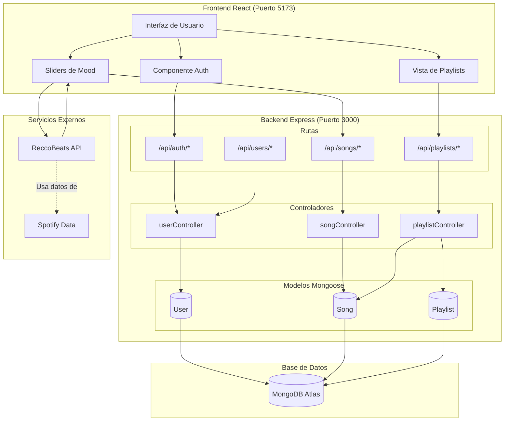
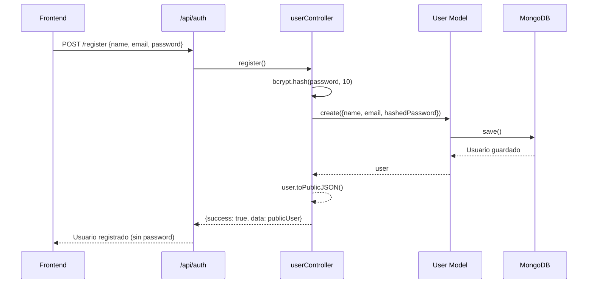
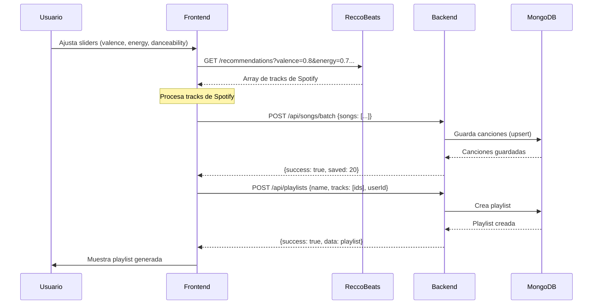
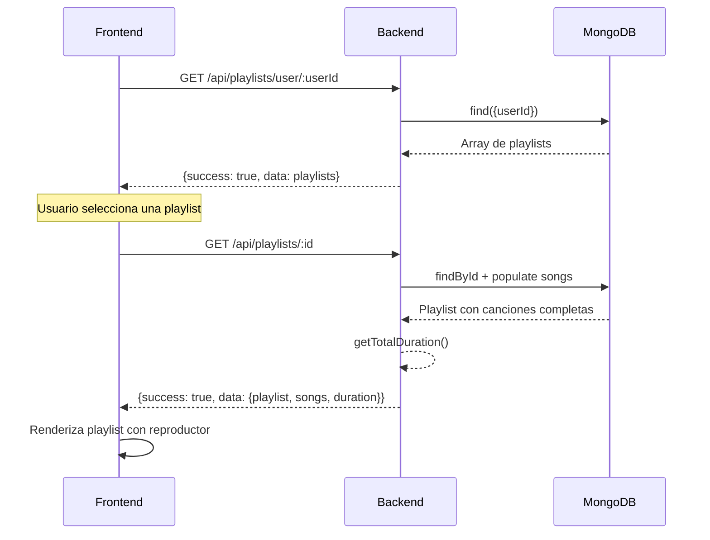
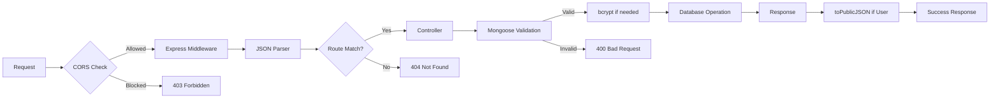
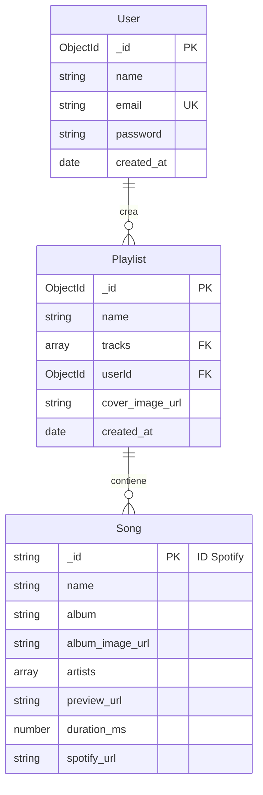

# Arquitectura Implementada - Backend

## 🏗️ Diagrama de Arquitectura Completa



## 📊 Flujo de Datos Detallado

### 1. Registro/Login de Usuario



### 2. Generación de Playlist



### 3. Visualización de Playlists del Usuario



## 🗂️ Estructura de Datos

### User
```json
{
  "_id": "ObjectId",
  "name": "Juan Pérez",
  "email": "juan@example.com",
  "password": "$2b$10$...", // Hasheado
  "created_at": "2025-11-18T10:00:00Z",
  "createdAt": "2025-11-18T10:00:00Z",
  "updatedAt": "2025-11-18T10:00:00Z"
}
```

### Song
```json
{
  "_id": "3n3Ppam7vgaVa1iaRUc9Lp", // ID de Spotify
  "name": "Mr. Brightside",
  "album": "Hot Fuss",
  "album_image_url": "https://i.scdn.co/image/...",
  "artists": ["The Killers"],
  "preview_url": "https://p.scdn.co/mp3-preview/...",
  "duration_ms": 222200,
  "spotify_url": "https://open.spotify.com/track/...",
  "createdAt": "2025-11-18T10:00:00Z",
  "updatedAt": "2025-11-18T10:00:00Z"
}
```

### Playlist
```json
{
  "_id": "ObjectId",
  "name": "Energía Positiva",
  "tracks": ["3n3Ppam7vgaVa1iaRUc9Lp", "0VjIjW4GlUZAMYd2vXMi3b"],
  "userId": "ObjectId",
  "cover_image_url": "https://i.scdn.co/image/...",
  "spotify_url": null,
  "created_at": "2025-11-18T10:00:00Z",
  "createdAt": "2025-11-18T10:00:00Z",
  "updatedAt": "2025-11-18T10:00:00Z"
}
```

## 🔐 Capa de Seguridad



## 📡 Endpoints por Módulo

### Autenticación (2 endpoints)
```
POST /api/auth/register
POST /api/auth/login
```

### Usuarios (5 endpoints)
```
GET    /api/users
GET    /api/users/:id
PUT    /api/users/:id
PUT    /api/users/:id/change-password
DELETE /api/users/:id
```

### Canciones (7 endpoints)
```
GET    /api/songs
GET    /api/songs/search
GET    /api/songs/:id
POST   /api/songs
POST   /api/songs/batch
POST   /api/songs/by-ids
DELETE /api/songs/:id
```

### Playlists (6 endpoints)
```
GET    /api/playlists/user/:userId
GET    /api/playlists/:id
POST   /api/playlists
PUT    /api/playlists/:id
DELETE /api/playlists/:id
POST   /api/playlists/:id/tracks
```

**Total: 20 endpoints REST**

## 🔄 Relaciones entre Modelos



## 🚀 Stack Tecnológico Implementado

### Backend
- **Runtime:** Node.js
- **Framework:** Express.js 4.21.2
- **Base de Datos:** MongoDB con Mongoose 8.20.0
- **Seguridad:** bcrypt 6.0.0
- **CORS:** cors 2.8.5
- **Logging:** morgan 1.10.1
- **Variables de Entorno:** dotenv 17.2.3

### Desarrollo
- **Hot Reload:** nodemon 3.1.11
- **Testing:** (Pendiente - Jest, Maestro)

### Despliegue (Preparado)
- **Backend:** Render / Heroku
- **Database:** MongoDB Atlas
- **Frontend:** Vercel

## 📈 Métricas del Sistema

| Métrica | Valor |
|---------|-------|
| Modelos | 3 |
| Controladores | 3 |
| Funciones de controlador | 18 |
| Rutas | 3 archivos |
| Endpoints REST | 20 |
| Validaciones Mongoose | 15+ |
| Índices de base de datos | 8 |
| Métodos de modelo | 10+ |
| Líneas de código | ~1500 |
| Archivos de documentación | 7 |

---

**Última actualización:** 2025-11-18  
**Estado:** ✅ Producción Ready para MVP

