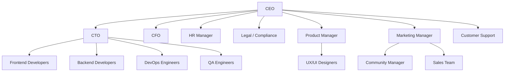

# Estructura Organizativa – PlayTheMood

## 1. Tipo de empresa

PlayTheMood se conceptualiza como una **startup tecnológica con modelo SaaS (Software as a Service)** enfocada en la personalización de experiencias musicales mediante el uso de inteligencia de datos y la integración con APIs externas como Spotify.

El modelo de negocio se basa en:
- Suscripción premium para funcionalidades avanzadas.
- Posibles acuerdos con plataformas de streaming.
- Escalabilidad en la nube.

---

## 2. Estructura organizativa propuesta

La empresa adopta una **estructura organizativa funcional**, donde los equipos se agrupan por especialidad.  
Este modelo es ideal para startups tecnológicas porque:

- Permite una alta especialización técnica.
- Facilita la comunicación interna.
- Escala fácilmente a medida que crece la empresa.

---

## 3. Departamentos y funciones

### Dirección

**CEO (Chief Executive Officer)**
- Define la visión y estrategia de la empresa.
- Toma decisiones clave de negocio.
- Representa a la empresa ante socios e inversores.

---

### Departamento de Desarrollo

**CTO (Chief Technology Officer)**
- Diseña la arquitectura técnica de la plataforma.
- Selecciona tecnologías y supervisa el desarrollo.

**Frontend Developers**
- Desarrollo de la interfaz de usuario con React + Vite.
- Integración con APIs y gestión de estados.

**Backend Developers**
- Desarrollo del backend con Node.js y Express.
- Diseño de la API REST.
- Integración con MongoDB y Spotify API.

**DevOps Engineers**
- Automatización de despliegues (CI/CD).
- Gestión de servidores, contenedores y monitorización.

**QA Engineers (Quality Assurance)**
- Diseño y ejecución de pruebas.
- Garantía de calidad del software.

---

### Departamento de Producto

**Product Manager**
- Define la hoja de ruta (roadmap) del producto.
- Prioriza funcionalidades según valor para el usuario.

**UX/UI Designers**
- Diseño de experiencia de usuario.
- Creación de prototipos y wireframes.

---

### Departamento de Marketing y Ventas

**Marketing Manager**
- Estrategias de captación y posicionamiento.

**Community Manager**
- Gestión de redes sociales y comunidad.

**Sales Team**
- Relación con clientes y control de suscripciones.

---

### Departamento de Atención al Cliente

**Customer Support**
- Soporte técnico a usuarios.
- Gestión de incidencias.

---

### Departamento de Administración

**CFO (Chief Financial Officer)**
- Gestión financiera y presupuestos.

**HR Manager**
- Selección y gestión del talento.

**Legal / Compliance**
- Cumplimiento legal (protección de datos, licencias, etc.).

---

## 4. Organigrama (Mermaid)

Este diagrama se puede visualizar directamente en GitHub:

## 5. Justificación de la estructura

Se eligió una estructura funcional porque:
- Permite un alto grado de especialización técnica.
- Es fácil de escalar.
- Reduce la duplicidad de tareas.
- Facilita el control de calidad.

6. Tamaño inicial del equipo
EL tamaño del equipo consta de 3 personas que inicialmente cubren varios roles en este proyecto.

   | Rol                | Nº personas |
   | ------------------ |-------------|
   | CEO                | 1           |
   | CTO                | 2           |
   | Frontend Developer | 3           |
   | Backend Developer  | 3           |
   | UX/UI Designer     | 3           |
   | Marketing Manager  | 3           |
   | Customer Support   | 3           |

7. Escalado de la empresa
Con el crecimiento de la empresa:
- Se añadirán más desarrolladores frontend y backend.
- Se creará un equipo DevOps dedicado.
- Se ampliará Customer Support.
- Se formalizarán los equipos de QA y Ventas.
- Se incorporarán perfiles legales y financieros más especializados.