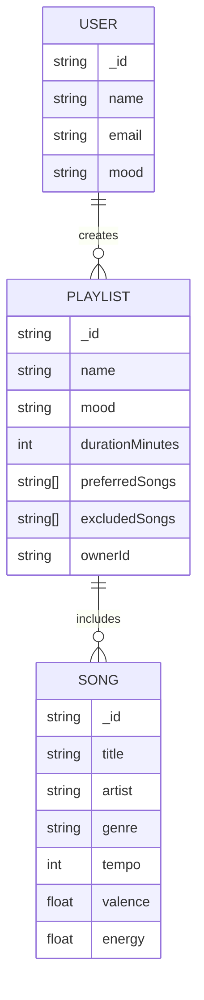
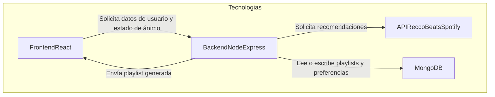

# Fase 2: Estudio de viabilidad técnica

# Índice

1. [Requisitos funcionales priorizados](#1-requisitos-funcionales-priorizados)
2. [Requisitos técnicos del stack MERN](#2-requisitos-técnicos-del-stack-mern)
3. [Esquema de base de datos (diagrama)](#3-esquema-de-base-de-datos-diagrama)
4. [Arquitectura de la aplicación (diagrama)](#4-arquitectura-de-la-aplicación-diagrama)
5. [Evaluación de capacidades del equipo](#5-evaluación-de-capacidades-del-equipo)
6. [Análisis de riesgos y mitigaciones](#6-análisis-de-riesgos-y-mitigaciones)

---

## 1. Requisitos funcionales priorizados

Las funcionalidades principales del proyecto son las siguientes:

- **Generación de playlist de Spotify - Must have.** Para que el programa pueda funcionar, la playlist debe poder ser creada automáticamente.

- **Sliders para determinar el estado de ánimo - Must have.** Para personalizar la playlist como el proyecto lo pide, el usuario deberá de ser capaz de introducir datos para que estos afecten a la playlist, lo que se traduce como sliders que alteran el estado de ánimo general de la playlist.

- **Importar playlist directamente a Spotify - Should have.** Para ahorrar aún más tiempo, el usuario debería de ser capaz de importar su playlist a Spotify directamente.

- **Generar la playlist en función de un tiempo máximo - Should have.** Idealmente, el usuario debería de ser capaz de determinar un tiempo límite para la playlist, ya que esta puede ser generada y acabar demasiado larga o demasiado corta.

- **Añadir canciones preferidas - Should have.** Para mejorar la experiencia y volverla más personal, el usuario debería de ser capaz de poner unas cuantas canciones como ejemplo para poder generar una playlist acorde con su estado de ánimo y sus gustos musicales.

- **Evitar canciones en la playlist - Should have.** De la misma forma que el usuario debería de ser capaz de añadir canciones preferidas, el usuario tendría que ser capaz de denegar la inclusión de ciertas canciones en su playlist, bien sea por un artista o género en particular.

- **Mostrar estado de ánimo general a partir de los sliders - Could have.** Esta funcionalidad podría ayudar al usuario a ver cómo los sliders están afectando a la emoción general de la playlist en caso de que no sean lo suficientemente intuitivos, sin embargo esto es solo un añadido de responsividad dentro de la web.

- **Crear playlist en YouTube - Could have.** En caso de no querer usar Spotify, esta funcionalidad permitiría al usuario poder crear sus playlists en YouTube, tomando las coincidencias en nombre y artista como referencia. Sin embargo, esto aumentaría la complejidad del programa y sería considerado como la primera meta adicional del Roadmap.

- **Generación de la playlist con IA - Won’t have.** La generación de la playlist se hace de forma automática con un algoritmo, por lo que la implementación de Inteligencia Artificial solo añadiría complejidad innecesaria al programa.

Por esto, el MVP deberá contener únicamente las funcionalidades clasificadas como “Must have”. Por ende, las 2 funcionalidades para el producto mínimo viable son:

- La generación de una playlist de Spotify: Sin esta funcionalidad, no hay programa base.

- Determinar un estado de ánimo para generar la playlist: Para poder cumplir la función de especificar la emoción para la generación de la playlist se necesitan introducir parámetros, por lo que esta funcionalidad es esencial para el MVP.

---

## 2. Requisitos técnicos del stack MERN

El desarrollo técnico de (Nombre de la app) se realizará utilizando el stack MERN, que integra cuatro tecnologías clave para aplicaciones web modernas: **MongoDB, Express, React y Node.** Este enfoque permitirá construir una plataforma robusta y flexible, donde la interfaz gráfica, la lógica del servidor y la gestión de datos se articulan de manera eficiente.

- **React** se empleará para dar forma a la experiencia de usuario, ofreciendo una interacción dinámica y amigable.
- **Express y Node** se encargarán de gestionar la comunicación entre la interfaz y la base de datos, además de integrar las funcionalidades principales, como la autenticación y el procesamiento de información proveniente de servicios externos, particularmente la API de Spotify.
- Por su parte, **MongoDB** servirá como sistema de almacenamiento para toda la información relevante del proyecto, asegurando que los datos sean accesibles y escalables para futuras ampliaciones.

En términos de despliegue, se tiene pensado desplegar en servicios en la nube como Vercel (para el frontend) y Render o Heroku (para el backend), utilizando MongoDB Atlas como base de datos gestionada, lo que permitirá asegurar la disponibilidad, flexibilidad y facilidad de mantenimiento del proyecto desde el primer MVP.

---

## 3. Esquema de base de datos (diagrama)

## 4. Arquitectura de la aplicación (diagrama)

## 5. Evaluación de capacidades del equipo

En términos de experiencia, como equipo tenemos bastante conocimiento con respecto al **diseño de frontend**, por lo que podemos garantizar que la página sea intuitiva y visualmente atractiva. 

Además, todos hemos trabajado con APIs en el pasado, por lo que tenemos más facilidad a la hora de hacer llamadas y trabajar con estas. 

Sin embargo, aunque  todo el equipo está familiarizado con el uso de Git, IDEs modernos (IntelliJ, WebStorm) y plataformas como Discord para la organización interna, en términos de trabajo grupal nunca hemos trabajado con Scrum en un proyecto tan grande, por lo que la organización y definición de roles es algo que debemos de tener muy en cuenta.

Se necesita aprender:

- **Stack MERN:** Aunque conocen para qué se usa, ninguno ha realizado un proyecto real con MERN (MongoDB, Express, React, Node). Hará falta aprender y practicar el flujo básico, la configuración y la integración global.
- **API ReccoBeats:** Se necesita revisar y comprender a fondo el funcionamiento interno de la API pública usada para recomendaciones musicales, tanto su estructura como sus limitaciones y mejores prácticas de consumo.
- **Scrum y trabajo grupal estructurado:** Nunca se ha trabajado con Scrum en un proyecto grande, por lo que será necesario aprender su funcionamiento básico, la definición clara de roles y cómo gestionar los sprints, reuniones y revisiones.
- **Testing automatizado y despliegue:** Aunque se han usado herramientas de testing (Jest, React Testing Library, Maestro), el despliegue continuo y el aseguramiento de calidad a nivel profesional requiere aún afianzar la metodología e integración.

Teniendo en cuenta el reparto de roles, la experiencia previa del equipo en frontend, diseño y consumo de APIs, y la capacidad para comunicarse y adaptarse organizativamente, la finalización del proyecto dentro del plazo previsto resulta realista, siempre y cuando se mantenga el enfoque en el MVP, el cual prioriza el núcleo de la solución y descarta integraciones complejas. No obstante, existen ciertos desafíos que requieren especial atención, como la curva de aprendizaje asociada al stack MERN y la implementación de Scrum —siendo esta última una novedad para el grupo— así como la posible aparición de problemas derivados de la API pública, tanto en lo relativo a cambios imprevistos como a limitaciones de uso o interrupciones. Para mitigar estos riesgos, se plantea una estructuración modular de tareas y sprints cortos, acompañados de revisiones semanales y feedback continuo, además de una formación interna acelerada sobre MERN y Scrum, apoyada por recursos digitales y la colaboración entre integrantes. La realización de pruebas constantes garantizará no solo la funcionalidad y la usabilidad del producto, sino también una detección temprana de dificultades, permitiendo su resolución antes de que se conviertan en bloqueos para el avance general del proyecto.

---

## 6. Análisis de riesgos y mitigaciones

El riesgo principal de nuestro proyecto es la utilización de una API pública, la cual presenta los siguientes riesgos:

- **Riesgo 1**: Cambios en la API pública (Spotify API)
  - **Mitigación**: Estar atentos a las actualizaciones oficiales y mantener buenas prácticas de versionado y refactorización para actualizar rápidamente el código.
- **Riesgo 2**: Caídas o interrupciones temporales de la API o servidores externos
  - **Mitigación**: Implementar un sistema de gestión de errores para informar y tranquilizar al usuario si ocurre una caída temporal. Considerar alternativas o cachés locales temporales si es viable.
- **Riesgo 3**: Limitaciones de uso gratuito de la API (rate limits, cuotas)
  - **Mitigación**: Monitorizar el número de peticiones realizadas y comunicar al usuario si se alcanza el límite. Priorizar funcionalidades críticas y buscar posibles soluciones premium si el proyecto escala.
- **Riesgo 4**: Falta de experiencia con metodologías ágiles como Scrum
  - **Mitigación**: Formación interna breve sobre Scrum y roles, uso de herramientas colaborativas (GitHub Projects, Discord) para facilitar organización y gestión de tareas.
- **Riesgo 5**: Incertidumbre en los tiempos de desarrollo y entrega
  - **Mitigación**: Desglose de tareas, estimaciones realistas y reuniones semanales de seguimiento para detectar posibles retrasos y reasignar recursos si es necesario.

---

