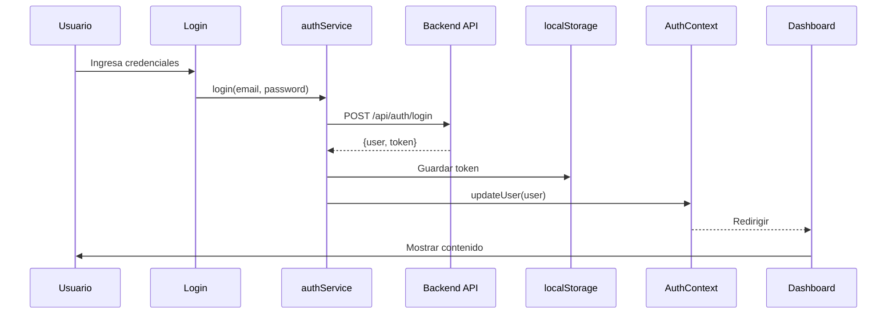

# PlayTheMood - Frontend

> Aplicación web React para generar playlists musicales personalizadas basadas en tu estado de ánimo, powered by Spotify.


---

## Descripción

PlayTheMood Frontend es una Single Page Application (SPA) construida con React que permite a los usuarios:

- **Autenticarse de forma segura** con JWT tokens
- **Generar playlists personalizadas** basadas en su estado de ánimo actual
- **Explorar canciones** de Spotify con búsqueda avanzada
- **Gestionar sus playlists** (crear, editar, eliminar)
- **Personalizar parámetros musicales** (energía, valencia, tempo, etc.)
- **Guardar configuraciones** de generación para reutilizar

La aplicación se integra con el backend REST API de PlayTheMood y la API de Spotify para ofrecer una experiencia musical personalizada.

---

## Tech Stack

### Core
- **[React](https://react.dev/)** v19.1 - Library UI con hooks modernos
- **[Vite](https://vite.dev/)** v7.1 (Rolldown) - Build tool ultra-rápido
- **[React Router](https://reactrouter.com/)** v7.9 - Enrutamiento SPA

### HTTP & Estado
- **[Axios](https://axios-http.com/)** v1.13 - Cliente HTTP con interceptores
- **Context API** - Gestión de estado global (Auth, User)

### Desarrollo
- **[ESLint](https://eslint.org/)** v9.36 - Linter de código
- **[MSW](https://mswjs.io/)** v2.12 - Mock Service Worker para testing

### Características
- Hot Module Replacement (HMR)
- Lazy loading de componentes
- CSS Modules para estilos aislados
- Rutas protegidas con autenticación
- Diseño responsive

---

## Estructura del Proyecto

```
frontend/
├── public/                     # Archivos estáticos
│   ├── mockServiceWorker.js   # MSW para mocking
│   └── vite.svg               # Favicon
│
├── src/
│   ├── assets/                # Recursos multimedia
│   │   ├── background.svg
│   │   ├── backgroundvideo.mp4
│   │   └── disc.png
│   │
│   ├── components/            # Componentes reutilizables
│   │   ├── atoms/            # Componentes básicos (Button, Input)
│   │   ├── molecules/        # Componentes compuestos
│   │   └── organisms/        # Componentes complejos
│   │
│   ├── constants/            # Constantes y configuración
│   │   ├── apiConfig.js     # URLs del backend
│   │   └── musicPresets.js  # Presets musicales (K-pop, Chill, etc.)
│   │
│   ├── contexts/             # Context API
│   │   └── AuthContext.jsx  # Estado de autenticación global
│   │
│   ├── hooks/                # Custom hooks
│   │   └── UseAuth.jsx      # Hook de autenticación
│   │
│   ├── layouts/              # Layouts de página
│   │   └── MainLayout.jsx
│   │
│   ├── pages/                # Páginas/Vistas
│   │   ├── Login.jsx
│   │   ├── Register.jsx
│   │   ├── Dashboard.jsx
│   │   ├── Generate.jsx
│   │   └── PlaylistView.jsx
│   │
│   ├── router/               # Configuración de rutas
│   │   └── Router.jsx
│   │
│   ├── services/             # Servicios de API
│   │   ├── api.js           # Instancia Axios configurada
│   │   ├── authService.js   # Servicios de autenticación
│   │   └── userService.js   # Servicios de usuario
│   │
│   ├── styles/               # Estilos globales y módulos
│   │   ├── Login.module.css
│   │   ├── Generate.module.css
│   │   └── ...
│   │
│   ├── utils/                # Utilidades
│   │   ├── formValidation.js # Validaciones de formularios
│   │   └── GetUserData.jsx   # Helper de datos de usuario
│   │
│   ├── App.jsx               # Componente raíz
│   ├── main.jsx              # Entry point
│   └── index.css             # Estilos base
│
├── .env.example              # Variables de entorno (template)
├── .gitignore               # Archivos ignorados por Git
├── eslint.config.js         # Configuración ESLint
├── package.json             # Dependencias y scripts
├── README.md                # Este archivo
└── vite.config.js           # Configuración Vite
```

---

## Instalación

### Requisitos Previos

- **Node.js** >= 18.0.0
- **npm** >= 9.0.0 o **pnpm** >= 8.0.0
- **Backend API** corriendo en puerto 3000 (ver `/backend`)

### Pasos de Instalación

1. **Clonar el repositorio**
   ```bash
   git clone https://github.com/tu-usuario/ProyectoIntermodularGrupal.git
   cd ProyectoIntermodularGrupal/frontend
   ```

2. **Instalar dependencias**
   ```bash
   npm install
   # o
   pnpm install
   ```

3. **Configurar variables de entorno**
   ```bash
   cp .env.example .env
   ```

   Editar `.env` con tus valores:
   ```env
   VITE_API_BASE_URL=http://localhost:3000
   ```

4. **Iniciar servidor de desarrollo**
   ```bash
   npm run dev
   ```

   La aplicación estará disponible en: **http://localhost:5173**

---

## Scripts Disponibles

```bash
# Desarrollo con hot reload
npm run dev

# Compilar para producción
npm run build

# Previsualizar build de producción
npm run preview

# Linter de código
npm run lint
```

---

## Variables de Entorno

Crear archivo `.env` en la raíz del frontend:

```env
# URL del backend API (sin /api al final)
VITE_API_BASE_URL=http://localhost:3000

# Para producción
# VITE_API_BASE_URL=https://tu-backend.com
```

**Importante:** Todas las variables en Vite **DEBEN** empezar con `VITE_` para estar disponibles en el cliente.

---

## Características Principales

### Autenticación Segura
- Login con email y contraseña
- Registro de nuevos usuarios
- JWT tokens con duración de 7 días
- Protección de rutas privadas
- Logout automático en expiración

### Generador de Playlists
- **12 presets musicales predefinidos:**
  - K-pop, Chill, Party, Workout, Focus, Sleep
  - Jazz, Rock, Electronic, Latin, Indie, Classical
  
- **Parámetros personalizables:**
  - Energía (0-100)
  - Valencia/Positividad (0-100)
  - Bailabilidad (0-100)
  - Acústica (0-100)
  - Instrumentalidad (0-100)
  - Tempo (BPM)
  - Popularidad (0-100)
  
- **Búsqueda de canciones semilla**
- **Tamaño de playlist ajustable** (5-50 canciones)

### Gestión de Playlists
- Ver todas tus playlists
- Editar nombre y configuración
- Eliminar playlists
- Agregar/quitar canciones
- Portadas personalizadas

### Interfaz de Usuario
- Diseño moderno y responsive
- Animaciones suaves
- Feedback visual de acciones
- Manejo de estados de carga
- Mensajes de error claros

---

## Arquitectura

```
┌─────────────────────────────────────────┐
│         Components (UI)                 │
│  ┌────────┐  ┌────────┐  ┌────────┐    │
│  │ Atoms  │  │Molecules│ │Organisms│   │
│  └────────┘  └────────┘  └────────┘    │
└──────────────────┬──────────────────────┘
                   │
┌──────────────────▼──────────────────────┐
│         Pages/Views                     │
│  Login | Register | Dashboard | Generate│
└──────────────────┬──────────────────────┘
                   │
┌──────────────────▼──────────────────────┐
│    Context API (Estado Global)          │
│         AuthContext                     │
└──────────────────┬──────────────────────┘
                   │
┌──────────────────▼──────────────────────┐
│         Services (API)                  │
│  authService | userService | api.js    │
└──────────────────┬──────────────────────┘
                   │ HTTP/REST
                   ▼
          Backend API (Port 3000)
```

---

## Flujo de Autenticación



---

## Seguridad

### Implementado
- ✅ JWT tokens con expiración
- ✅ Tokens almacenados en localStorage (HttpOnly cookies en roadmap)
- ✅ Validación de formularios client-side
- ✅ Rutas protegidas con redirección
- ✅ Logout automático en token expirado
- ✅ Sanitización de inputs

### Mejores Prácticas
- No se almacenan contraseñas en el cliente
- Tokens enviados en header `Authorization: Bearer`
- HTTPS obligatorio en producción
- CORS configurado correctamente

---

## Testing

```bash
# Ejecutar linter
npm run lint

# MSW está configurado para mocking
# Ver public/mockServiceWorker.js
```

---

## Build para Producción

```bash
# Compilar
npm run build

# Los archivos compilados estarán en /dist
# Servir con cualquier servidor estático (Nginx, Apache, Vercel, Netlify)
```

### Despliegue Recomendado

**Vercel:**
```bash
vercel deploy
```

**Netlify:**
```bash
netlify deploy --prod
```

**Nginx:**
```nginx
server {
    listen 80;
    server_name tu-dominio.com;
    
    root /var/www/playthemood/dist;
    index index.html;
    
    location / {
        try_files $uri $uri/ /index.html;
    }
}
```

---

## Solución de Problemas

### Error: CORS
**Síntoma:** Peticiones bloqueadas por CORS

**Solución:**
1. Verificar que `VITE_API_BASE_URL` en `.env` sea correcto
2. Verificar CORS en backend (`FRONTEND_URL` en backend/.env)
3. Asegurar que backend esté corriendo

### Error: 401 Unauthorized
**Síntoma:** Redirección a login constantemente

**Solución:**
1. Verificar que el token en localStorage sea válido
2. Hacer logout y volver a iniciar sesión
3. Verificar que `JWT_SECRET` del backend no haya cambiado

### Build Falla
**Síntoma:** `npm run build` falla

**Solución:**
```bash
# Limpiar y reinstalar
rm -rf node_modules package-lock.json
npm install
npm run build
```

---

## Contribuir

1. Fork el proyecto
2. Crear branch de feature (`git checkout -b feature/AmazingFeature`)
3. Commit cambios (`git commit -m 'Add some AmazingFeature'`)
4. Push al branch (`git push origin feature/AmazingFeature`)
5. Abrir Pull Request

---

## Licencia

Este proyecto es parte de un Proyecto Intermodular Grupal.

---

## Equipo

- **Frontend Developers** - Interfaz de usuario y experiencia
- **Backend Developers** - API REST y base de datos
- **DevOps** - Despliegue y CI/CD

---

## Enlaces Útiles

- [Backend API Documentation](../backend/README.md)
- [Spotify Web API](https://developer.spotify.com/documentation/web-api)
- [React Documentation](https://react.dev)
- [Vite Documentation](https://vite.dev)

